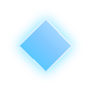

<div align="center">


<br/>


<br/>

[](https://apxtech.pages.dev)
[](mailto:moi24ad@gmail.com)
[](https://github.com/Moises-ab24)

<br/>


</div>

---

### &nbsp; About Me

```
Desarrollador joven enfocado en construir productos digitales completos —
desde aplicaciones web y móviles hasta sistemas de gestión a medida.
```

---

### &nbsp; Tech Stack

<div align="center">

**Languages**


**Frontend**


**Backend & Databases**


**Cloud, DevOps & Tooling**


</div>

---

### &nbsp; AI-Assisted Engineering

<div align="center">

| Domain | Proficiency | Details |
|---|:---:|---|
| Desarrollo asistido por IA | ⭐⭐⭐⭐ | Uso avanzado de herramientas de IA integradas al flujo de desarrollo diario |
| Prompt Engineering | ⭐⭐⭐⭐ | Diseño de prompts estructurados para generación de código, documentación y diseño |
| Agentes de IA | ⭐⭐⭐ | Formación práctica en programación con agentes (BIG School) |
| IA aplicada a datos | ⭐⭐⭐ | PowerBI + IA para análisis y visualización de datos |

</div>

---

### &nbsp; Experience

**Founder & Lead Developer — APX Tech**
*En curso*

Fundador y desarrollador principal de una agencia de software enfocada en soluciones digitales completas para clientes y negocios.

- Diseño y desarrollo de aplicaciones web, sistemas de gestión y sitios corporativos
- Arquitectura full-stack: frontend, backend, bases de datos e infraestructura de despliegue
- Gestión de relación con clientes en conjunto con el equipo comercial

`React` `TypeScript` `Vite` `Firebase` `Supabase` `Cloudflare Pages`

<br/>

**Pasantía — Departamento de TI, Grupo Monge**
*22 de septiembre – 3 de octubre, 2025*

- Inventario y etiquetado de dispositivos tecnológicos
- Mantenimiento preventivo de laptops y computadoras de escritorio
- Soporte técnico general al área de TI

`Hardware` `Mantenimiento` `Soporte Técnico`

---

### &nbsp; Certifications

<div align="center">

**Udemy**


**Cisco Networking Academy**


**Otros**


</div>

---

### &nbsp; GitHub Analytics

<div align="center">


</div>

---

### &nbsp; Contribution Activity

<div align="center">


</div>

---

### &nbsp; Connect

<div align="center">

[](mailto:moi24ad@gmail.com)
[](https://apxtech.pages.dev)
[](https://github.com/Moises-ab24)

</div>

---

<div align="center">

*"La percepción define los resultados."*


</div>
